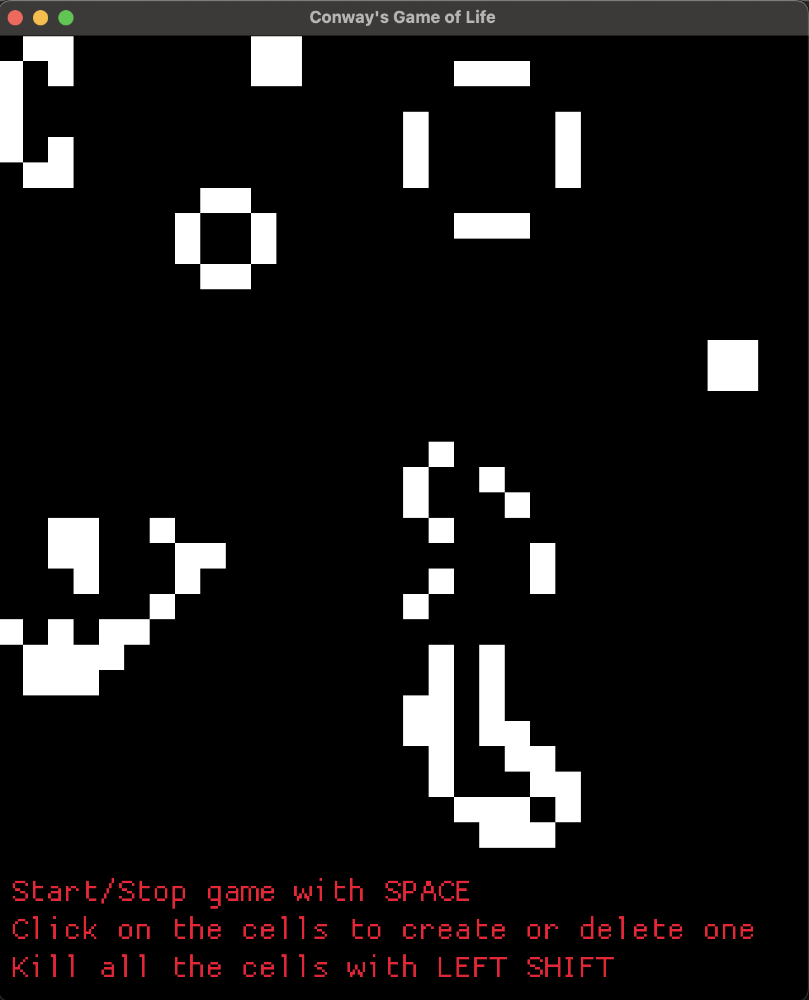

# conways-game-of-life

Implementation of [Conway's Game of Life](https://en.wikipedia.org/wiki/Conway%27s_Game_of_Life) in Rust.



## Usage

- Clone the repository and navigate to the project directory.
  ```shell
      git clone git@github.com:damiramirez/conways-life.git && cd conways-life
  ```
- Run the project
  ```shell
      make run
  ```

## Functionality

- The game is played on a 2D grid of cells. Each cell can be either alive or dead.
- The game follows the rules:

  - Any live cell with fewer than two live neighbours dies, as if caused by underpopulation.
  - Any live cell with two or three live neighbours lives on to the next generation.
  - Any live cell with more than three live neighbours dies, as if by overpopulation.
  - Any dead cell with exactly three live neighbours becomes a live cell, as if by reproduction.

- You can pause the game by pressing the `SPACE` key.
- You can kill all the cells pressing the `LEFT SHIFT` key.
- You can click on a cell to toggle its state.
